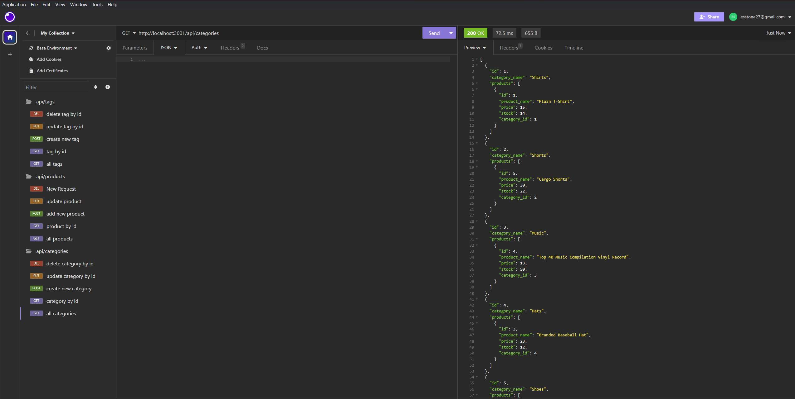

# e-commerce

## Description
This activity was created to practice creating api routes to look at, manipulate, and delete data from a data base.

## Usage
Use a program such as Insomnia to hit api routes and get, update, or delete data from a database.

## Installation
run npm i in command line to install al dependencies

## Credits
Ethan Stone and UCLA Boot Campt

## License
N/A